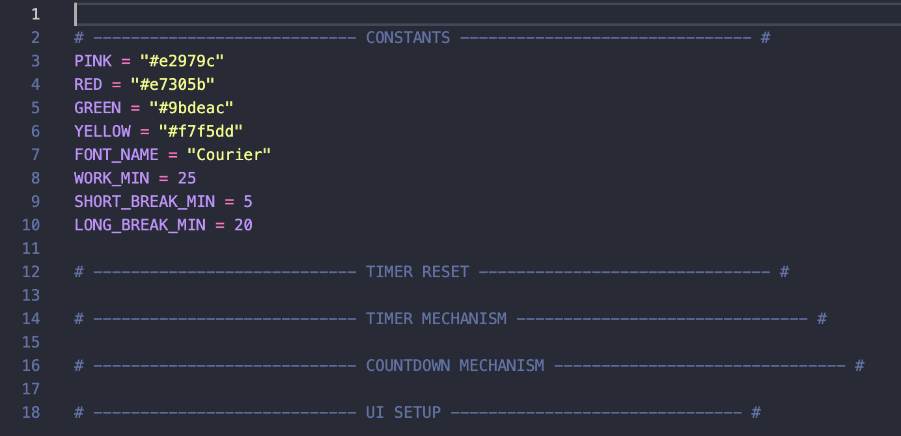

# Day 28: Pomodoro!

This project had me finish building a GUI application for tracking the Pomodoro technique of working, which involves short sprints of 25 minutes working surrounded by short breaks. I was given the following main.py to start from.

